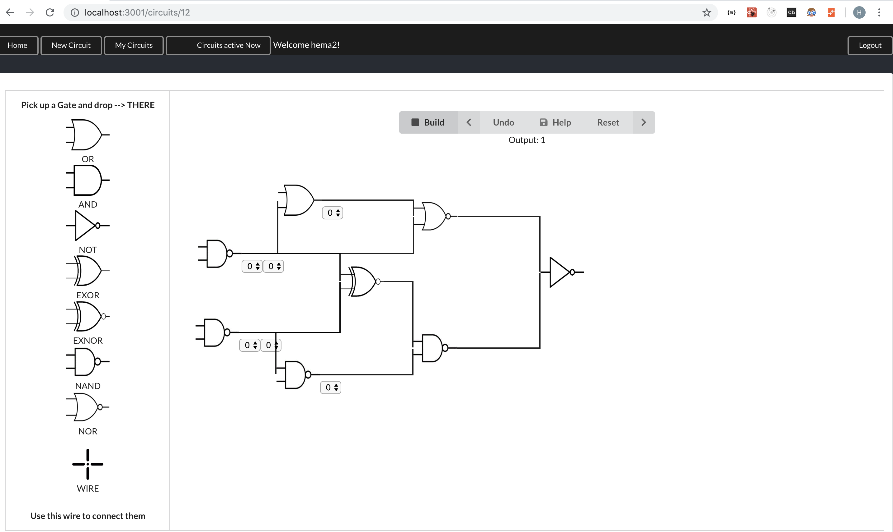
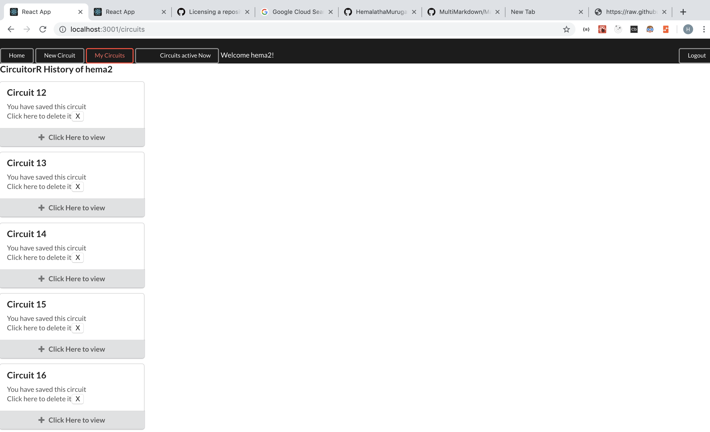
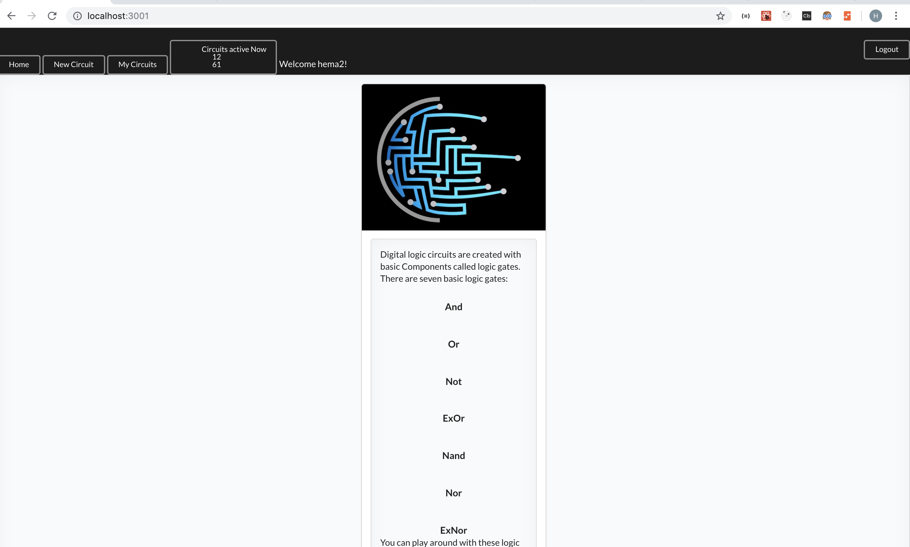

# CircuitorR

A real time multi-user app for collaboratively drawing and edit digital logic circuits with basic logic gates, simulate and see the results.

## Abstract

CircuitorR aims to give the users an opportunity to playaround with different logic gates and understand their functionalities by changing the binary inputs and/or place them in connection with other gates and check the binary outputs.

### Usage

The user can login and create new circuits by drag and drop the logic gates from the gates container to the circuit container. Connections can be given by dragging the wire and hover over the intended input gate first and then over the intended output gate and drop it right there. The number of output gates is limited to one for simplicity. Input binary values can be changed using the small dropdown select options. simulation can be done by hitting the 'Build' button. Binary output value will be displayed as the simulation result. 'Undo' button helps to reset the latest change and 'Reset' button helps to reset the whole circuit. Invalid circuits will be alerted. 

    

User account saves the all the circuits which can be viewed by clicking the 'My circuits' button and the user can delete a circuit by clicking 'x' button on the circuit card. 

    

By clicking 'Circuits active now', the user can see the ciruits that are actively being built in real time by other users. The user has the option to select one of them and enter inside that circuit and collaboratively work on it. 

    

#### Demo 

[Youtube link](https://www.youtube.com/watch?v=YiMw6rQiVAM&t=1s)

